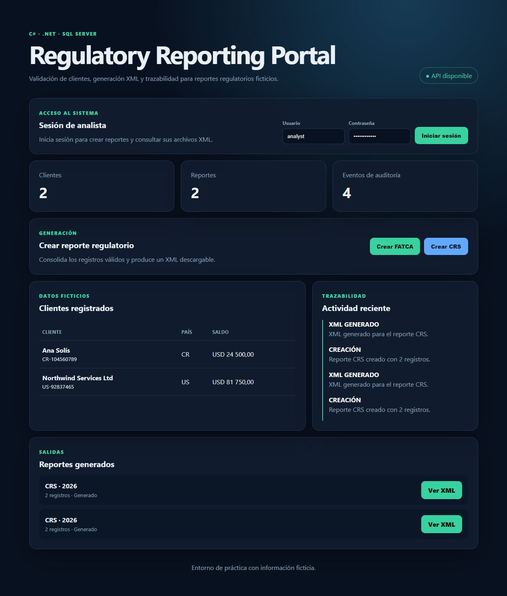
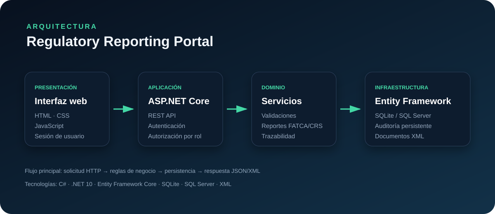

# Regulatory Reporting Portal

Regulatory reporting system built with C# and ASP.NET Core. It covers business-rule validation, XML generation, API design, auditability, SQL modeling, and a responsive web interface.

> The system uses fictional data and a simplified reporting format. It does not contain confidential information, proprietary code, or an official FATCA/CRS schema.



## Features

- REST API for client and report management.
- Cookie-based authentication and role-protected write operations.
- Validation of tax identifiers, country codes, age, balances, and currencies.
- FATCA/CRS-style XML generation with a custom internal namespace.
- Immutable audit trail for important operations.
- Responsive dashboard built with HTML, CSS, and vanilla JavaScript.
- SQL Server relational schema included in `database/schema.sql`.
- Example requests included in `RegulatoryReportingPortal.http`.

## Technology

- .NET 10 and ASP.NET Core Minimal APIs
- C#
- XML with LINQ to XML
- Entity Framework Core with SQLite and SQL Server providers
- HTML, CSS, and JavaScript

## Run locally

```powershell
dotnet run --project RegulatoryReportingPortal.csproj --urls http://localhost:5074
```

Open `http://localhost:5074` in a browser.

Local demo credentials:

- User: `analyst`
- Password: `Analyst2026!`

These credentials are intentionally public and are intended only for the local demonstration environment. They must be replaced before any real deployment.

## API endpoints

| Method | Endpoint | Purpose |
|---|---|---|
| GET | `/api/health` | Service health |
| POST | `/api/session/login` | Start an analyst session |
| POST | `/api/session/logout` | End the current session |
| GET | `/api/clients` | List clients |
| POST | `/api/clients` | Validate and create a client |
| GET | `/api/reports` | List reports |
| POST | `/api/reports` | Create a FATCA or CRS report |
| GET | `/api/reports/{id}/xml` | Generate report XML |
| GET | `/api/audit` | Review the audit trail |

## Architecture



```text
Browser dashboard
       |
ASP.NET Core REST API
       |
Business validation + report service
       |
Entity Framework Core + SQLite / SQL Server
       |
XML output + audit trail
```

The application stores clients, reports, report relationships, and audit events with Entity Framework Core. SQLite is enabled by default so the system can run without database credentials. On first execution, it creates `Data/regulatory-reporting.db` and inserts two fictional client records.

To use SQL Server Express, change `DatabaseProvider` in `appsettings.json` from `Sqlite` to `SqlServer`. The SQL Server connection string and relational schema are already included.

## Functional tests

With the application running, execute:

```powershell
.\scripts\smoke-test.ps1
```

The script verifies health checks, anonymous access protection, analyst login, validation errors, report creation, and XML generation.

## Planned improvements

- Automated unit and integration tests.
- Official schema validation through configurable XSD files.
- Docker-based local environment.
